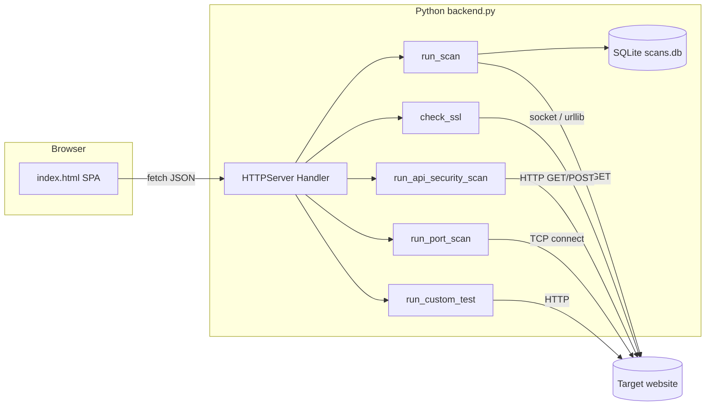

# ProScanner (VulnScan Pro) — Complete Project Handoff & Presentation Guide

This document is written for someone who must **understand, demonstrate, and present** the project (for example, to a college instructor) as if they developed it. It explains what the system does, how it is built, how to run it, and what to say in an academic setting.

---

## 1. Executive summary (what to tell your teacher in one minute)

**ProScanner** is a **web security assessment tool** with a browser-based user interface. It helps users **probe HTTP/HTTPS targets** for common classes of vulnerabilities (inspired by OWASP categories), check **TLS/SSL configuration**, run a **lightweight API security pass** over chosen paths, perform a **limited port scan** on the target host, and **store scan history** in a local database.

The product is implemented as:

- A **single-page web application** (`index.html`) — dark “security terminal” style UI, no separate frontend build step.
- A **Python HTTP server** (`backend.py`) that serves the UI, exposes a **REST-style JSON API**, runs scans, and persists data in **SQLite** (`scans.db`).

**Important honesty note for presentations:** The scanner uses **heuristics** (response body patterns, timing, status codes). A “finding” is **not** the same as a confirmed exploit. False positives and false negatives are possible. Responsible use and **authorization** before scanning any target are essential (see Section 11).

---

## 2. Problem statement & objectives (academic framing)

**Problem:** Manual security review of web applications is slow; teams benefit from tools that **automate repetitive checks** and **organize results** for triage.

**Objectives this project meets:**

1. Provide a **unified dashboard** for several assessment workflows (parameter fuzzing, SSL, API paths, ports, custom tests).
2. **Educate** via OWASP-aligned remediation hints bundled with findings.
3. **Persist** results for comparison over time (history, dashboard aggregates).
4. Keep deployment **simple**: Python standard library + one HTML file + SQLite.

---

## 3. System architecture



**Data flow (typical vulnerability scan):**

1. User enters a URL (usually with **query parameters**, e.g. `https://example.com/page?id=1`).
2. Backend parses the query string and takes **each parameter name** as an injection point.
3. If there are **no** query parameters, the backend falls back to testing a synthetic parameter named `id` (logged as a warning).
4. For each test in the selected **categories**, the server builds a URL with the payload substituted into that parameter and issues **HTTP GET** requests.
5. Responses are compared against **regex signatures** (SQL errors, reflected XSS markers, etc.), **time delays** (time-based SQLi), and **HTTP error transitions** relative to a small baseline.
6. Results plus optional SSL metadata are **saved** to SQLite and returned as JSON to the UI.

**Concurrency:** A semaphore limits **at most 3** concurrent full scans (`MAX_CONCURRENT_SCANS = 3`).

---

## 4. Technology stack

| Layer | Technology |
|--------|------------|
| Backend | Python 3, `http.server` (`HTTPServer`, `BaseHTTPRequestHandler`) |
| HTTP client | `urllib.request`, `ssl`, `socket` |
| Database | SQLite3 (`scans.db`), WAL journal mode |
| Frontend | Plain HTML, CSS, JavaScript (no React/Vue/npm build) |
| Fonts | Google Fonts (Inter, JetBrains Mono) — requires network in browser |

**Dependencies:** The backend uses **only the Python standard library** (no `requirements.txt` in-repo). You need a working **Python 3** interpreter.

---

## 5. Repository layout

| Path | Role |
|------|------|
| `backend.py` | Entire server: API routes, scan engines, DB, OWASP fix text, payload library |
| `index.html` | Full UI: navigation, forms, charts, log tail, fetch calls to API |
| `scans.db` | SQLite database (created/updated at runtime; may appear with `-wal`/`-shm` in WAL mode) |
| `.git/` | Version control (exclude local DB from submissions if policy requires) |

The server tries to serve `index_redesigned.html` first, then **`index.html`**, for the root path `/`.

---

## 6. How to run the project

1. Open a terminal in the project directory:

   `d:\Avi's-PROJECT\files\ProScanner` (or your clone path).

2. Start the backend:

   ```bash
   python backend.py
   ```

3. Default listen address: **`0.0.0.0:8765`** (configurable via environment variable `PORT`).

4. Open a browser:

   `http://localhost:8765/`

**Frontend configuration:** In `index.html`, the API base URL is set as:

```javascript
const API = 'http://localhost:8765';
```

If you deploy elsewhere, update this to match the server’s host and port.

**Health check:** The UI probes `http://localhost:8765/api/scans` on load; failure usually means `backend.py` is not running or the port is blocked.

---

## 7. User-facing modules (pages in the UI)

These correspond to sidebar navigation (`data-page` attributes):

| Page | Purpose |
|------|---------|
| **Scanner** | Main OWASP-style parameter scanning; optional category filter |
| **SSL** | Standalone TLS/HTTPS certificate and HSTS-oriented check |
| **API Security** | GET/POST probes + injection attempts on a user-supplied list of paths |
| **Port Scanner** | TCP connect scan of a **fixed set** of well-known ports on the URL’s host |
| **Custom Tests** | Save and run user-defined GET/POST checks with optional expected status |
| **Dashboard** | Aggregated charts: stats, categories, risk, 14-day timeline, top targets |
| **History** | List of past scans from DB |
| **Report** | Drill into a single scan’s results |
| **Payloads** | Browse payload definitions fetched from `/api/payloads` |
| **Simulation** | Educational / demo-oriented content in the UI |

---

## 8. HTTP API reference (JSON)

Base URL: `http://localhost:8765` (default).

### GET

| Endpoint | Description |
|----------|-------------|
| `/` | Serves `index_redesigned.html` or `index.html` |
| `/api/scans` | List all scans (metadata, no full results blob in list) |
| `/api/scans/{id}` | Single scan including parsed `results` JSON |
| `/api/stats` | `{ total, vulnerable, safe }` |
| `/api/dashboard` | Rich aggregates for charts |
| `/api/logs?since=N` | Streaming log buffer from index `N` |
| `/api/payloads` | Full `VULNERABILITY_TESTS` array |
| `/api/categories` | List of category names (from OWASP fix keys) |
| `/api/owasp_fixes` | Full remediation dictionary |
| `/api/custom_tests` | All saved custom tests |

### POST

| Endpoint | Body (JSON) | Description |
|----------|-------------|-------------|
| `/api/scan` | `{ "url": "...", "categories": ["SQL Injection", ...] }` — `categories` optional | Full parameter scan + optional SSL |
| `/api/ssl` | `{ "url": "..." }` | SSL/TLS check only |
| `/api/api_security` | `{ "url": "...", "paths": ["/api/users", ...] }` — `paths` optional | API security pass (default path list if omitted) |
| `/api/port_scan` | `{ "url": "..." }` | Port scan on host derived from URL |
| `/api/custom_tests` | `{ "name", "url", "description?", "method?", "payload?", "category?", "expected_status?" }` | Create custom test |
| `/api/custom_tests/{id}/run` | (empty body) | Execute custom test |

### DELETE

| Endpoint | Description |
|----------|-------------|
| `/api/scans/{id}` | Delete scan row |
| `/api/custom_tests/{id}` | Delete custom test |
| `/api/logs` | Clear in-memory log buffer |

**CORS:** Responses include `Access-Control-Allow-Origin: *` (convenient for local dev; tighten for production).

**OPTIONS:** Handled for preflight.

---

## 9. Security & safety features in the backend

- **SSRF / internal network guard:** `validate_url()` only allows `http`/`https` and **rejects hostnames that resolve to private/loopback/link-local** ranges (e.g. `10.x`, `192.168.x`, `127.x`, `169.254.x`).
- **Payload size limits** on POST bodies (e.g. scan body max 8192 bytes for `/api/scan`).
- **No shelling out** for scans: tests use Python’s HTTP and socket APIs.

Present these as **defense-in-depth** choices: they reduce accidental misuse but do not replace legal authorization.

---

## 10. Database schema (SQLite)

### Table `scans`

| Column | Type | Meaning |
|--------|------|---------|
| `id` | INTEGER PK | Auto-increment |
| `target_url` | TEXT | Scanned URL |
| `scan_time` | TEXT | Timestamp string (UTC formatted in code) |
| `total_tests` | INTEGER | Count of test executions |
| `vulnerabilities_found` | INTEGER | Count of findings flagged vulnerable |
| `status` | TEXT | `VULNERABLE` or `SAFE` |
| `duration_seconds` | REAL | Wall time |
| `results` | TEXT | JSON array of per-test result objects |

### Table `custom_tests`

| Column | Meaning |
|--------|---------|
| `id` | Primary key |
| `name`, `description` | User labels |
| `url` | Target (method applied by server) |
| `method` | `GET` or `POST` (default GET) |
| `payload` | Optional; appended as `input` query param for GET, JSON `input` for POST |
| `category` | Default `Custom` |
| `expected_status` | Optional HTTP status expectation |
| `created_at` | UTC timestamp string |

---

## 11. Vulnerability categories & payloads (high level)

The constant **`VULNERABILITY_TESTS`** in `backend.py` defines many entries. Each has: `id`, `name`, `payload`, `category`, `type`, `risk`.

**Categories include (non-exhaustive):** SQL Injection, XSS, Path Traversal, Command Injection, SSTI, Open Redirect, XXE, SSRF, NoSQL Injection, Header Injection, Prototype Pollution, LDAP Injection, GraphQL.

**SSL/TLS** is handled separately via `check_ssl()` and can be included when the user selects the **SSL/TLS** category or runs a full scan without filtering.

**`OWASP_FIXES`:** For several categories, structured remediation text (OWASP Top 10 2021 references, severity, bullet-point fixes, sometimes bad/good code snippets) is attached to findings in results.

---

## 12. Detection logic (how to explain it academically)

**Error-based / reflection:** The server searches response bodies with **`ERROR_SIGNATURES`** (compiled regexes) for database errors, script reflection, `/etc/passwd` patterns, etc.

**Time-based:** If a payload is classified as time-based (or contains sleep-like keywords), the request timeout is extended; delays **≥ ~4.5s** (`TIME_BASED_THRESHOLD`) vs baseline contribute to a “medium” confidence flag.

**Behavioral:** New HTTP 500/503 when baseline was clean can contribute to a medium-confidence flag.

**API module:** Combines:

- GET and JSON POST per path
- Heuristic flags: CORS `*`, sensitive field patterns in JSON/text, missing security headers, open JSON without auth signals
- Optional injection matrix (`INJECTION_PAYLOADS`)
- Rapid repeated GETs to infer **absence of rate limiting** (heuristic)

**Port scan:** Sequential TCP connect to a **fixed dictionary** of ports (`PORT_DEFINITIONS`); marks open ports and suggests hardening per service.

---

## 13. Limitations (important for Q&A)

1. **Only GET-based injection** for the main scanner (payloads in query string); no automatic POST body crawling.
2. **Single parameter at a time** from the URL query string; no form parser.
3. **Heuristic output** — not a replacement for professional penetration testing or DAST products.
4. **Port list is fixed** — not a full nmap-style scan.
5. **API scanner** uses generic paths and payloads; real APIs need tailored auth, headers, and flows.
6. **Browser fonts** load from Google — offline demos may look different unless cached.

---

## 14. Suggested presentation outline (10–15 minutes)

1. **Motivation:** Web apps face OWASP-class issues; automation helps developers and students learn.
2. **Demo:** Start `python backend.py`, open UI, run a scan on an **authorized** test target (e.g. a local deliberately vulnerable lab, or a public intentionally vulnerable training app if your institution allows it).
3. **Architecture:** Browser SPA + Python `http.server` + SQLite; show diagram (Section 3).
4. **Core algorithm:** Query parameters → inject payloads → classify responses.
5. **Extra modules:** SSL check, API path analyzer, port scan, custom tests.
6. **Ethics & law:** Only scan systems you own or have **written permission** to test; unauthorized scanning may be illegal.
7. **Limitations:** Heuristics, false positives, not exhaustive coverage.

---

## 15. Glossary (for slides)

| Term | Short definition |
|------|-------------------|
| **OWASP** | Open Web Application Security Project; publishes Top 10 and guidance |
| **SQLi** | SQL injection — untrusted input interpreted as SQL |
| **XSS** | Cross-site scripting — untrusted script in HTML context |
| **SSRF** | Server-side request forgery — server tricked into calling internal URLs |
| **TLS/SSL** | Encryption and identity for HTTPS |
| **Heuristic scan** | Rule-based signals, not guaranteed exploitation |
| **SQLite** | Embedded file-based relational database |

---

## 16. Naming consistency note

The **browser title** reads “ProScanner v4 — Security Terminal” while `backend.py` docstrings refer to “VulnScan Pro v3”. For presentations, pick one product name or say “ProScanner / VulnScan Pro” are the same codebase with evolving UI versioning.

---

## 17. Quick troubleshooting

| Symptom | Likely cause |
|---------|----------------|
| UI shows offline / cannot load scans | `backend.py` not running or wrong `API` URL in `index.html` |
| Port already in use | Another process on 8765; set `PORT` env var |
| Target rejected | Private IP/hostname blocked by `validate_url` |
| Empty or odd history | `scans.db` missing or from different machine — DB is local state |

---

## 18. Academic integrity note

If this project is submitted for graded work, **institutional rules require** that credit and authorship reflect actual contribution. Presenting someone else’s work as solely your own without disclosure may violate honor codes. Use this handoff **transparently** as documentation for a team transfer, open-source contribution, or with instructor approval.

---

*End of handoff document. For code-level details, read `backend.py` (server and engines) and search `index.html` for `fetch(` and `API`.*
